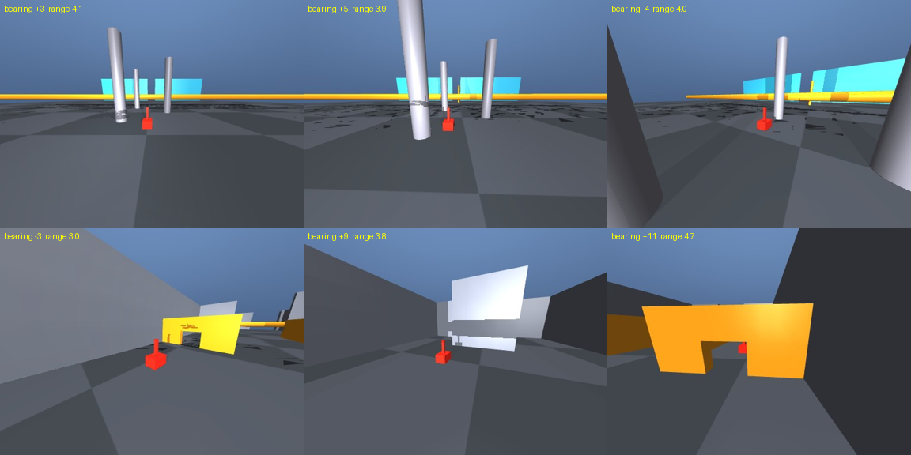

# Probe: can zero-shot Laya see where the rover is?

The check before handing pursuit to Laya. `probe.py collect` flew the oracle on the classic and
`mixed` courses (seeds 0-2, 60 s each) and saved the onboard frame every 0.5 s, 684 frames in all,
with the ground truth from the simulator: the rover's bearing off the nose, its range, and whether
it is in view (segmentation). `modal run modal_laya.py::probe` then asked `thaitea/laya-vision`
four questions about each frame, zero-shot, with the full option descriptions.



The frames are fair: the rover is in view in 562 of them, at a median of about 590 pixels in the
512×384 frame, a distinct red box with a mast.

| question | zero-shot Laya | baseline |
|---|---|---|
| `visible` (noul): is the rover in the image? | AUC 0.70 | 0.50 |
| `where` (choice): left / centre / right third, or not visible | 17% correct | 78% (always the commonest) |
| `steer` (score, 5 levels): which way to turn | 31% correct, rank corr. with bearing −0.04 | 57% (always "straight") |
| `steer`, side only (rover more than 7° off the nose) | 48% | 50% |
| `speed` (score, 4 levels): how far away | 28% correct, rank corr. with range 0.07 | 65% (always "slow") |

Details in `summary-perm1.json`; per-frame answers in `preds-perm1.jsonl`.

- **`where` answers "not visible" for 603 of 684 frames**, never "centre", although the rover is in
  view in 82% of them and near the centre in most.
- **`steer` and `speed` are flat.** The mean probabilities over visible frames are
  [0.19, 0.20, 0.22, 0.20, 0.20] and [0.28, 0.27, 0.23, 0.22], almost uniform, and they do not
  move with the true bearing or range.
- **The only signal is `visible`, AUC 0.70:** something about the red box registers, but not
  where it is.

**Verdict:** zero-shot Laya cannot fly pursuit. Its steering would be a coin flip. That matches
the tactical results: the checkpoint reads these synthetic frames poorly. The next step is a
fine-tune, and the labels are free. Every frame here already carries its true bearing and range,
and `collect` makes more at about 110 frames per simulated minute. The model to beat is the code
pursuit law, whose inputs are exactly these two numbers.

Reproduce:

```bash
MUJOCO_GL=osmesa python probe.py collect --out /tmp/probe
modal run modal_laya.py::probe --frames /tmp/probe
```
