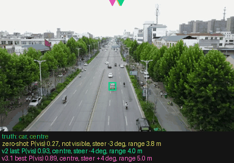
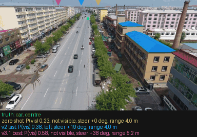
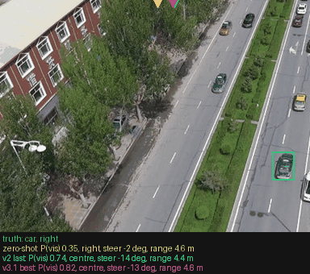
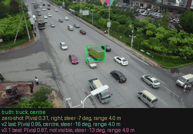
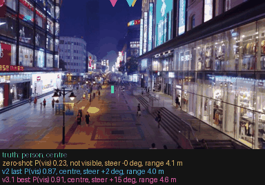
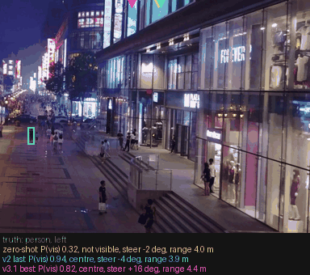

# Real-footage test: does the sim-trained perception transfer?

The drone-rover checkpoints learned to find a small red rover in MuJoCo frames. This test asks
the same four questions (`probe.questions_v2()`: `visible`, `where`, `steer7`, `range8`) about
real drone tracking footage, where the target is a car, a person, a truck or a cyclist. The
question is how much of the sim-trained skill carries over to real images. Evaluation only:
nothing here was trained on this footage.

## Sources and terms

| | UAV123 (Mueller, Smith, Ghanem, ECCV 2016) | VisDrone2019-SOT (Zhu et al., TPAMI 2021) |
|---|---|---|
| official page | [ivul.kaust.edu.sa](https://ivul.kaust.edu.sa/benchmark-and-simulator-uav-tracking-dataset) | [github.com/VisDrone/VisDrone-Dataset](https://github.com/VisDrone/VisDrone-Dataset) |
| what we read | the official `UAV123_10fps` zip (4.7 GB) from the page's Google Drive link | val + test-dev from the full SOT release (72.7 GB zip) |
| access | free: no form, no login | official Google Drive links: **"Quota exceeded"** on every part (val, test-dev, train 1/2) at build time. The Baidu mirror needs an account. We read a public, ungated Hugging Face re-upload, [huseyincavus/visdrone2019-sot](https://huggingface.co/datasets/huseyincavus/visdrone2019-sot). It is third-party: we checked the layout and annotation format, not byte identity. |
| licence | none stated on the official page or in the zip's ReadMe (only "please cite"); treated as research-only | CC BY-NC-SA 3.0, academic use (AISKYEYE, Tianjin University); the mirror says CC BY-NC 4.0 |

Both zips are read remotely with HTTP range requests (`realdata.RemoteFile`), so only the central
directory and the frames we use are transferred. The CPU jobs write only the subsampled, resized
frames to the `laya-datasets` volume (`/data/realtest/real-v1/`). No footage is on the local disk
or in git. Only code, score summaries and the six VisDrone sample images below are committed.

## The test set: `real-v1`, 4,185 frames from 104 sequences

- **UAV123:** every real `car*`, `person*`, `truck*` and `bike*` sub-sequence in `configSeqs.m`
  (68 sub-sequences from 48 videos). The rendered `*_s` sequences are left out. We keep every 6th
  frame of the 10 fps release (0.6 s apart), up to 24 per sub-sequence, plus every other NaN
  frame (up to 12). NaN means "fully occluded or out of view" per the ReadMe, so those are the
  natural negatives.
- **VisDrone-SOT:** the 36 val + test-dev sequences whose target is a car, truck or pedestrian.
  The release does not name the target's class, so we labelled each one by eye
  (`realdata.VISDRONE_CLASS`) and left out riders, a tricycle cart and animals. We keep every
  30th frame (1 s), up to 24 per sequence. VisDrone has a box on every frame (occlusion is only a
  sequence-level attribute), so it adds no natural negatives.
- **Views.** Tracking footage keeps the target near the centre: 81% of in-view full frames fall
  in the middle third. So, like `probe.py --yaw-jitter`, we add two kinds of crop:
  - `crop`: a 4:3 window, 60% of the frame height, placed so the target lands at a random
    horizontal position. This makes up 1,126 frames.
  - `crop-neg`: a window beside the target that leaves it out. This makes up 573 frames. These
    crops can contain *other* cars or people, so for "the car being followed" they are
    negatives by construction, not by appearance.
- All frames are resized to a 512 px long side.

| | full, in view | full, absent (NaN) | crop | crop-neg | total |
|---|---|---|---|---|---|
| UAV123 car / person / truck / bike | 606 / 787 / 118 / 71 | 70 / 130 / 0 / 6 | 302 / 378 / 56 / 36 | 152 / 197 / 29 / 18 | 2,956 |
| VisDrone car / person / truck | 362 / 287 / 49 | 0 | 184 / 145 / 25 | 92 / 72 / 13 | 1,229 |

**Truth per frame** (`realdata._box_row`):

- `visible`: the box is present and inside the view.
- `where`: which third of the width holds the box centre.
- Bearing, from the box centre, with an **assumed 70° horizontal field of view** for every full
  frame. The cameras' real FOV is not published; the sim camera is about 124°. A crop's FOV
  follows from its width.
- A range proxy, 1 / (box side as a fraction of the frame side). Only its rank means anything.

The FOV guess only affects the degree errors. The headline steering metrics use pixel offsets and
do not depend on it:

- side accuracy: frames whose box centre is more than 10% of the width off centre.
- Spearman rank correlation with dx, the box centre's offset from the image centre.

## Question wording

- **`rover`:** `probe.questions_v2()` exactly as trained ("...following a small red ground rover
  (a red box with a thin red mast). Is the red rover visible anywhere in the image?").
- **`target`:** `realdata.questions_real(cls)`, which only swaps the instructions: "...following
  a car on the ground. Is the car being followed visible anywhere in the image?". It uses
  person, truck, or cyclist for UAV123 `bike`. The options (criteria) are byte-identical to
  the rover's, including their wording about the rover. `questions_real(None)` equals
  `probe.questions_v2()`.

## Results

These are the full-set scores, where "rho" is the Spearman rank correlation. The sequence-level
bootstrap 90% intervals are in `bootstrap.json`. They are about ±0.03 to 0.05 for AUC, side
accuracy and steering rho, and about ±0.1 for the natural-negative AUC (206 negatives).

**Named target (`target` wording):**

| | visible AUC | AUC vs natural negatives | where (majority) | steer: side | steer rho vs dx | range rho vs box size | range rho within sequence |
|---|---|---|---|---|---|---|---|
| zero-shot thaitea/laya-vision | 0.72 | 0.72 | 0.22 (0.56) | 0.48 | -0.04 | -0.07 | 0.02 |
| drone-rover-v2/last | **0.79** | 0.81 | 0.55 (0.56) | **0.68** | **0.36** | 0.04 | -0.06 |
| drone-rover-v3.1/best | 0.78 | **0.82** | 0.53 (0.56) | 0.66 | 0.32 | 0.12 | 0.06 |
| baseline | 0.50 | 0.50 | majority | 0.50 | 0 | 0 | 0 |

**As trained (`rover` wording):**

| | visible AUC | AUC vs natural negatives | where (majority) | steer: side | steer rho vs dx | range rho vs box size | range rho within sequence |
|---|---|---|---|---|---|---|---|
| zero-shot | 0.59 | 0.62 | 0.20 (0.56) | 0.48 | -0.07 | -0.18 | -0.08 |
| v2 last | 0.55 | 0.65 | 0.29 (0.56) | 0.52 | 0.06 | 0.04 | -0.07 |
| v3.1 best | 0.52 | 0.61 | 0.29 (0.56) | 0.58 | 0.14 | 0.04 | 0.03 |

**Named target, split by view, class and dataset:**

| | zero-shot side / rho | v2 last side / rho | v3.1 best side / rho | v2 last AUC | v3.1 best AUC |
|---|---|---|---|---|---|
| full frames | 0.48 / -0.04 | 0.65 / 0.26 | 0.61 / 0.21 | 0.81 | 0.82 |
| crops (target spread across the frame) | 0.49 / -0.04 | **0.70 / 0.49** | **0.71 / 0.46** | - | - |
| car | 0.43 / -0.09 | **0.74 / 0.48** | **0.76 / 0.41** | 0.77 | 0.76 |
| person | 0.50 / -0.05 | 0.65 / 0.30 | 0.60 / 0.27 | 0.84 | 0.82 |
| UAV123 | 0.45 / -0.06 | 0.69 / 0.39 | 0.68 / 0.35 | 0.83 | 0.83 |
| VisDrone | 0.56 / 0.09 | 0.64 / 0.26 | 0.59 / 0.25 | 0.62* | 0.57* |

\* VisDrone has only crop negatives, which often contain other vehicles or people.

Every group, including truck and bike, is in `<run>/summary.json`:

- keys `all`, `all_full_frames`, `dataset=`, `cls=`, `view=`, and `dataset=,cls=`
- for each wording

**For reference, the same checkpoints on held-out sim frames** (`results/probe/rover-test/*/summary-v2.json`):

| | visible AUC | where acc | side | steer rho | range rho |
|---|---|---|---|---|---|
| v2 last | 0.997 | 0.96 | 0.98 | 0.97 | 0.89 |
| v3.1 best | 0.992 | 0.95 | 0.96 | 0.95 | 0.89 |

## What transfers and what does not

- **With the rover wording, almost nothing transfers.** The fine-tunes answer "not visible" for
  77-78% of real frames, and their `visible` AUC falls below zero-shot's (0.52-0.55 against 0.59).
  That is the right answer to the literal question, since there is no red rover in this
  footage. It shows that the trained "rover" concept is tied to the rover's look. It is not a
  general "the thing I am following".
- **With the target named, detection and direction partly transfer.** The fine-tunes reach
  AUC 0.78-0.79 against zero-shot's 0.72, and 0.81-0.82 against natural occlusion /
  out-of-view negatives.
  - Their steering signal is real but weak. The side is right 66-68% of the time, and the rank
    correlation with the box offset is 0.32-0.36. Zero-shot is at chance on both (0.48,
    -0.04).
  - On crops, where the target is spread across the frame, steering is better: side 0.70-0.71,
    rho 0.46-0.49.
  - It works best on cars (side 0.74-0.76) and on UAV123. VisDrone is weaker; its targets are
    smaller, in crowded street scenes.
  - The sim fine-tune taught the model to read image position into a turn command, and some of
    that carries over to real objects once the question names them.
- **The steering is compressed and biased, and it is too weak to fly on.**
  - The expected bearing spans only ±9° (v2, std) where the targets span the frame.
  - v3.1 leans left by about 8° on average.
  - Against the angle the sim camera would give the same pixel position, the mean error is no
    better than always answering "straight" (v2 22.3° against 23.7°; v3.1 23.6°).
  - Compare 0.97 rank correlation and 98% side accuracy in the sim.
- **`where` does not transfer.** Both fine-tunes answer "centre" or "not visible" for 93-96% of
  frames. Overall accuracy (0.53-0.55) matches the always-majority baseline (0.56). On the
  crops, where the target is often left or right, they score 0.33-0.34 against 0.42 for
  always-centre.
- **Range does not transfer.** The rank correlation of the `range8` answer with box size is
  0.04-0.12 overall and about 0 within a sequence. The model's answers barely move (std
  0.26-0.58 m around 4.3-4.7 m). Box size is a crude proxy for range, since the objects and
  camera heights differ. But the sim model's 0.89 has not survived in any form we can detect.
- **v2 against v3.1:**
  - They are within noise of each other on real footage. The bootstrap intervals overlap on
    every headline metric.
  - v3.1's extra reacquisition and rotated-view training neither helps nor hurts perception
    here.
  - v2 is slightly better at steering and `where` on VisDrone. v3.1 is slightly better at
    range.

**Bottom line:** sim-to-real transfer is partial. Naming the target unlocks a weak detector and a
coarse left/right sense, clearly better than zero-shot. Fine bearing, `where` and range do not
transfer. Flying on real imagery would need real (or much more realistic) training data. The
wording result also means a real deployment should ask about the actual target, not the rover.

## Samples

These are six VisDrone frames (CC BY-NC-SA 3.0, © AISKYEYE team, Tianjin University; shown for
non-commercial research) with the named-target answers drawn on.

- The box is green. The first text line gives the true class and third.
- Each checkpoint's line gives P(visible), its `where` answer, its expected steer (+ = left) and
  its range.
- The triangles on the top edge mark each checkpoint's steer read-out, placed with the sim
  camera's angle mapping: yellow is zero-shot, cyan is v2 last, magenta is v3.1 best.
- No UAV123 frames are shown, because its page states no licence terms.

| | |
|---|---|
|  |  |
|  |  |
|  |  |

## Regenerate

```bash
modal run modal_laya.py::realtest_inspect       # optional: the two zips' layouts, read remotely
modal run modal_laya.py::realtest_build         # 18 CPU jobs, ~15 min -> /data/realtest/real-v1/
modal run modal_laya.py::realtest_score --preds-dir /tmp/realtest-preds   # 3 L4 jobs, ~25 min each
modal run modal_laya.py::realtest_samples --preds-dir /tmp/realtest-preds --frames <names,...>
```

- `realtest_score` writes `results/realtest/<run>/summary.json`.
- Per-frame predictions carry the datasets' boxes, so they go only to `--preds-dir`, outside
  the repo.
- `bootstrap.json` was computed from those predictions with `realdata.score_real`, resampling
  sequences 300 times.
